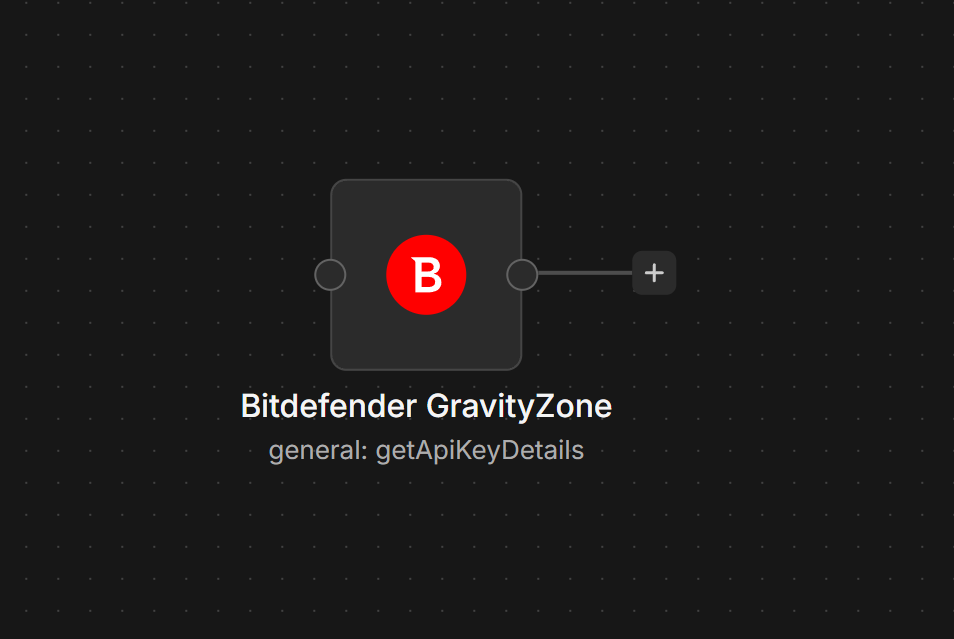
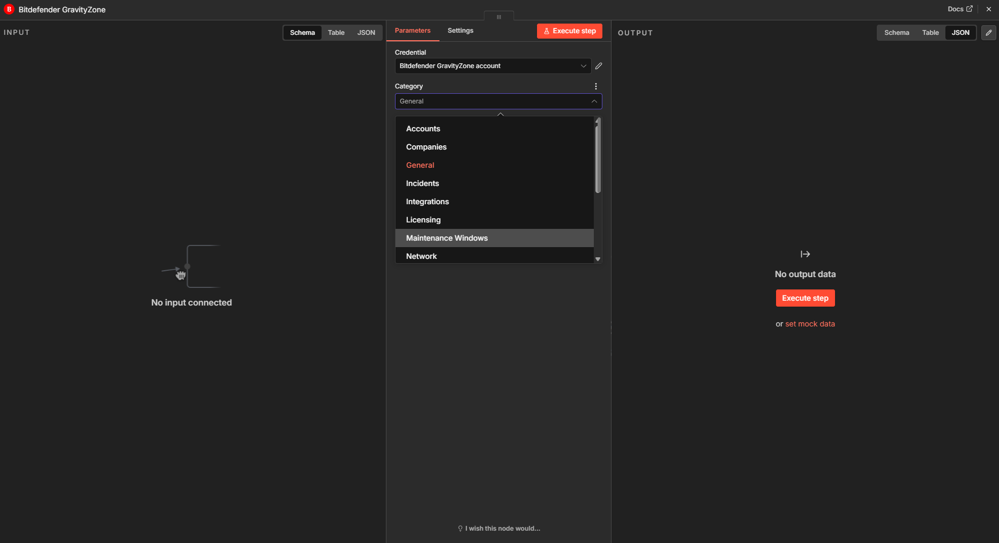

# n8n-nodes-gravityzone

This is an n8n community node. It lets you use the public Bitdefender GravityZone API in your n8n workflows.

Bitdefender GravityZone is a business cybersecurity platform for centrally managing protection across endpoints, cloud workloads, networks, identities, and productivity applications. It combines layered prevention, detection, response, hardening, machine learning, behavioral analysis, and optional EDR / XDR / MDR capabilities to help organizations stop and investigate threats.

  

  

[n8n](https://n8n.io/) is a [fair-code licensed](https://docs.n8n.io/sustainable-use-license/) workflow automation platform.

[Installation](#installation)
[Operations](#operations)
[Credentials](#credentials)
[Compatibility](#compatibility)
[Usage](#usage)
[Resources](#resources)
[Version history](#version-history)

## Installation

Follow the [installation guide](https://docs.n8n.io/integrations/community-nodes/installation/) in the n8n community nodes documentation.

## Operations

The node supports the following actions grouped by their respective category:

### Accounts

- Configure Notifications Settings
- Create
- Delete
- Get Details
- Get List
- Get Notifications Settings
- Update

### Companies

- Get Details
- Update Details

### General

- Generate Email Verification Code
- Get API Key Details

### Incidents

- Add to Blocklist
- Change Incident Status
- Create Custom Rule
- Create Isolate Endpoint Task
- Create Response Action
- Create Restore Endpoint From Isolation Task
- Delete Custom Rule
- Get Blocklist Items
- Get Custom Rules List
- Get Response Action Status
- Get Similar Emails
- Remove From Blocklist
- Update Custom Rule
- Update Incident Note

### Integrations

- Configure Amazon EC2 Integration Using Cross-Account Role
- Create Integration
- Delete Integration
- Disable Amazon EC2 Integration
- Generate Amazon EC2 External ID for Cross-Account Role
- Get Amazon EC2 External ID for Cross-Account Role
- Get Configured Integrations
- Get Hourly Usage for Amazon EC2 Instances
- Get Integration Details
- Manage Integration
- Update Integration

### Licensing

- Add Product Key
- Get License Info
- Get Monthly Usage
- Get Monthly Usage Per Product Type
- Remove Product Key
- Set License Key

### Maintenance Windows

- Assign Maintenance Windows
- Create Patch Management Maintenance Window
- Delete Maintenance Window
- Get Maintenance Window Details
- Get Maintenance Windows List
- Get Manually Approved Patches
- Unassign Maintenance Windows
- Update Patch Management Maintenance Window

### Network

- Add Integrators
- Assign Policy
- Create Custom Group
- Create Reconfigure Client Task
- Create Scan Task
- Create Scan Task by MAC
- Create Submit to Sandbox Analyzer Task
- Delete Custom Group
- Delete Endpoint
- Delete Task
- Get Custom Groups List
- Get Endpoints List
- Get Integrators
- Get Managed Endpoint Details
- Get Network Inventory Items
- Get Scan Tasks List
- Get Task Status
- Kill Process
- Move Custom Group
- Move Endpoints
- Remove Integrators
- Run Live Search Query
- Set Endpoint Label

### Packages

- Create Package
- Delete Package
- Get Installation Links
- Get Package Details
- Get Packages List
- Update Package

### Patch Management

- Get Installed Patches
- Get Missing Patches

### PHASR

- Apply Recommendations
- Edit Monitored Rules Access
- Get All Company Identities
- Get All Company Resources
- Get Monitored Rule Data
- Get Monitored Rules
- Get PHASR Recommendations
- Get Recommendation Profiles
- Take Request Access Action

### Policies

- Get Policies List
- Get Policy Details
- Set Policy Modules State

### Push

- Get Push Event Settings
- Get Push Event Stats
- Reset Push Event Stats
- Send Test Push Event
- Set Push Event Settings

### Quarantine

- Create Add File to Quarantine Task
- Create Empty Quarantine Task
- Create Release Quarantine Exchange Item Task
- Create Remove Quarantine Item Task
- Create Restore Quarantine Exchange Item Task
- Create Restore Quarantine Item Task
- Get Quarantine Items List

### Reports

- Create Report
- Delete Report
- Get Download Links
- Get Reports List

## Credentials

In order to use this node, you must authenticate with the Bitdefender GravityZone platform. For this step to work, you must already have a valid account. Follow these steps:

1. In GravityZone, navigate to **User Menu** > **My Account**. You should now be on the **Account details** page.
2. Scroll down to the **API keys** section and add a new API key.
3. Check the action categories of interest. Actions from unselected categories will be denied.
4. Save the newly generated API key, as you will not be able to see it again, as well as the access URL placed right above the **API keys** section.
5. Create new GravityZone credentials in n8n with those two strings.

## Compatibility

Compatible with n8n >= 2.x.  
Tested with n8n 2.19.5. 
No known incompatibilities.

## Resources

* [n8n community nodes documentation](https://docs.n8n.io/integrations/#community-nodes)
* [GravityZone public API documentation](https://www.bitdefender.com/business/support/en/77209-125277-public-api.html)